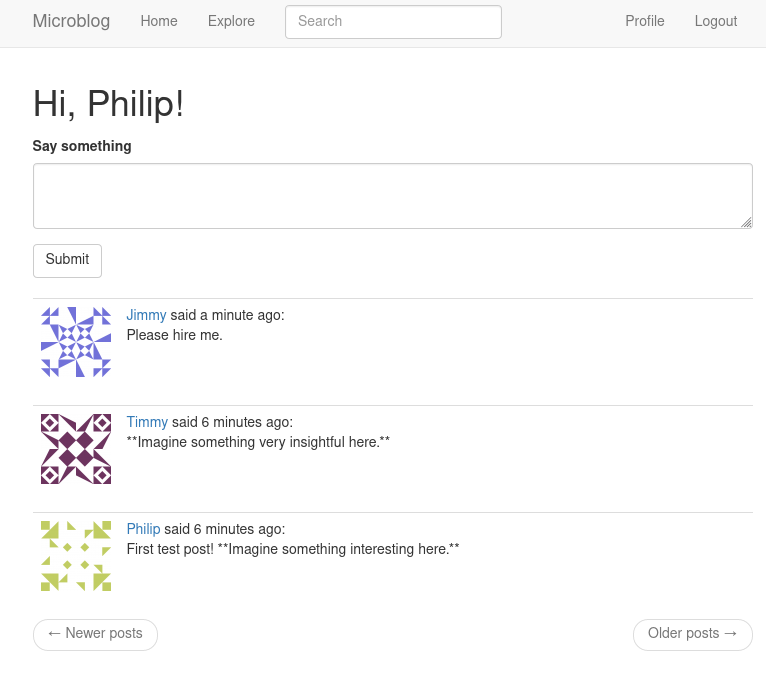

## Projects

##### [Hotel Cancellation Prediction (January 2021)](https://github.com/philipyoon/hotel_cancellation_prediction)
During popular seasons, predicting customer booking cancellations can ensure hotels accomodate the maximum number of customers. In this project I investigate the circumstances around customer cancellation and aim to find a best classification method to maximize classification accuracy of cancelled or not. I use Spark's Python API, PySpark, to utilize it's distributed nature for faster querying and transformations. The preprocessing step addressed missing and irrational values, outliers, column redundancy, one-hot and label encoding, and feature generation. After a 70/30 train-test split, I fit and evaluated a logistic regression model (testing with/without intercept and tuning iterations), a random forest model (tuning number of trees and max depth), and an SVM model (testing with/without intercept and tuning iterations), finally concluding the logistic regression approach best in terms of Accuracy, Recall, and AUC. See the paper in the project link to see specific techniques use.

##### [Microblog Web App with Flask (July 2020)](https://github.com/philipyoon/microblog)
On this web app, users can post short posts (think twitter) for their followers or see everyone's posts on the Explore page. The structure of the app is modular using Flask's blueprint and template framework and is hosted by Heroku. The database uses SQLAlchemy for object-relational mapping of the PostgreSQL DBMS. Passwords are stored using salted hashes with the werkzeug library, and password reset functionality uses JSON web tokens for validation. Full-text search for posts is supported using Elasticsearch service. Front-end is just simple HTML and CSS Bootstrap templates(which conveniently supports mobile pages). Planning to include deleting, upvoting, and commenting functionality.

[Link to Microblog](https://philips-microblog.herokuapp.com)

--- 

##### [Identifying App Features contributing to High Install Count (Jun 2020)](https://github.com/philipyoon/google-playstore-analysis)
The goal of every app on any mobile appstore is to maximize number of user installs. This project investigates the features that contribute to the top apps on the Google PlayStore with regard to install count based on web-scraped data from the [Google PlayStore](https://www.kaggle.com/lava18/google-play-store-apps). Visualizations are made with the Altair library and the final model to predict model install count is a ordered logistic regression model from the Python package *mord*. 

---

##### [Comparing Classifiers to Determine Diabetes Diagnosis (May 2020)](https://github.com/philipyoon/diabetes-classifier)
Based on certain diagnostic measurements like BMI, blood pressure, and glucose levels, would one be able to predict whether an individual has diabetes or not? Being able to identify and predict this disease would be the first step towards stopping its progression and recommending preventative measures for those of highest risk. In this project I test classification methods of SVM with linear and radial kernels, logistic regression, and kNN to predict diabetes diagnosis based on data from the National Institute of Diabetes and Digestive and Kidney Diseases. Final model resulted in logistic regression fit with probability threshold 0.29 and test accuracy of 71.5596% on a 70/20 train test split.

---

##### [Time Series Analysis on Gasoline Demand (Dec 2019)](https://github.com/philipyoon/gas-demand-analysis)
I attempt to forecast gasoline demand using industry data with classical (S)ARIMA models and time series techniques and adding different lag features. Best model was choseing using a basis of MLE estimators and AICc criterion. The model did well; however, diagnostic checking indicated the results of said techniques could be improved on.

---

##### [Loan Eligibility Classification (Jan 2019)](https://github.com/philipyoon/loan_eligibility_predictor)
Identifed which customers would be eligible for loans given a dataset. Modeled and evaluated performances of logistic regression, SVM, and decision tree classifier using 10 fold cross validation scores. Deployed the best trained model on a Heroku-hosted app that can be accessed using a basic API. Using F1 performance metrics, the logistic regression model performed best.

---

##### [IMDB Movie Rating Predictor (Dec 2018)](https://github.com/philipyoon/IMDB_movie_predictions)
Created a multiple linear regression model that proved to have some capability for predicting movie popularity as indicated by IMDB movie rating score.

---

##### [PCA Application: Data Visualization (Jun 2018)](https://github.com/philipyoon/pca-data-visualization-application)
Visualized a 4-dimensional dataset in 2 dimensions using PCA analysis on the popular iris dataset.

---

##### [Physician Count Regression (Jan 2018)](https://github.com/philipyoon/physician_count_regression)
Project using regression analysis to investigate two linear models; both investigating the number of professionally active nonfederal physicians during 1990 and which demographic variables affected this count most. 

