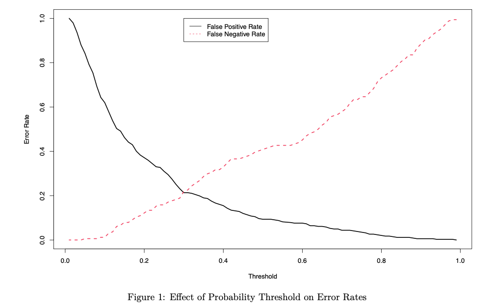

## Projects

##### [Microblog Web App with Flask (July 2020)](https://github.com/philipyoon/microblog)
On a microblog, users can post short posts (think twitter) and follow other users. The structure of the app is modular using Flask's blueprint and template framework and is hosted by Heroku. Database uses SQLAlchemy for object-relational mapping of PostgreSQL DBMS. Passwords are stored securely with salted hashes using werkzeug library, and password reset emails use JSON web tokens for validation. Full-text search for posts is supported using Elasticsearch service. Front-end was done using HTML and CSS framework Bootstrap templates. 

##### [Identifying App Features contributing to High Install Count (Jun 2020)](https://github.com/philipyoon/google-playstore-analysis)
When planning to list a mobile application, there is already a list of factors one must consider in order to create a successful app. What kind of app should I make? Does rating or install size even matter to increase the number of users I attract? In this project I identify the features that contribute to a high install count based on web-scraped data from the [Google PlayStore](https://www.kaggle.com/lava18/google-play-store-apps). 

I use Altair based on Vega-lite for visualzations and ordered logistic regression from the mord package as the classification model. 5-fold cv leads to a classifier with 63.35% accuracy.

---

##### [Comparing Classifiers to Determine Diabetes Diagnosis (May 2020)](https://github.com/philipyoon/diabetes-classifier)
Based on certain diagnostic measurements like BMI, blood pressure, and glucose levels, would one be able to predict whether an individual has diabetes or not? Being able to identify and predict this disease would be the first step towards stopping its progression and recommending preventative measures for those of highest risk. In this project I test classification methods of SVM with linear and radial kernels, logistic regression, and kNN to predict diabetes diagnosis based on data from the National Institute of Diabetes and Digestive and Kidney Diseases. Final model resulted in logistic regression fit with probability threshold 0.29 and test accuracy of 71.5596% on a 70/20 train test split.

##### [Time Series Analysis on Gasoline Demand (Dec 2019)](https://github.com/philipyoon/gas-demand-analysis)
Created a SARIMA model to forecast Ontario's gasoline demand using time series data. After a boxcox transformation and differencing at lags 1 and 12, the stationary data’s ACF and PACF were analyzed to estimate SARIMA models for forecasting. A stationary and invertible model was then chosen using MLE estimation of parameters, AICc criterion, and the principle of parsimony, which was then used to forecast Ontario's gasoline demand. The model did well; however, diagnostic checking indicated the results of said techniques were not perfect.

---

##### [Loan Eligibility Classification (Jan 2019)](https://github.com/philipyoon/loan_eligibility_predictor)
Identifed which customers would be eligible for loans given a dataset. Modeled and evaluated performances of logistic regression, SVM, and decision tree classifier using 10 fold cross validation scores. Deployed best model with Flask and Heroku so others can easily access them through an API. Using F1 performance metrics, logistic regression performed best.

---

##### [IMDB Movie Rating Predictor (Dec 2018)](https://github.com/philipyoon/IMDB_movie_predictions)
Created a multiple linear regression model that proved to have some capability for predicting movie popularity as indicated by IMDB movie rating score.

---

##### [PCA Application: Data Visualization (Jun 2018)](https://github.com/philipyoon/pca-data-visualization-application)
Visualized a 4-dimensional dataset in 2 dimensions using PCA analysis on the popular iris dataset.

---

##### [Physician Count Regression (Jan 2018)](https://github.com/philipyoon/physician_count_regression)
Project using regression analysis to investigate two linear models; both investigating the number of professionally active nonfederal physicians during 1990 and which demographic variables affected this count most. 

